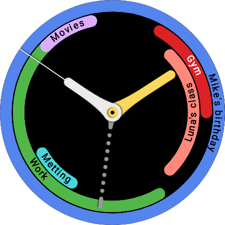

[![lang](https://img.shields.io/badge/English-gray.svg?logo=data:image/svg%2bxml;base64,PD94bWwgdmVyc2lvbj0iMS4wIj8+Cjxzdmcgd2lkdGg9IjMyIiBoZWlnaHQ9IjMyIiB4bWxucz0iaHR0cDovL3d3dy53My5vcmcvMjAwMC9zdmciIHhtbG5zOnN2Zz0iaHR0cDovL3d3dy53My5vcmcvMjAwMC9zdmciPgogPGcgY2xhc3M9ImxheWVyIj4KICA8dGl0bGU+TGF5ZXIgMTwvdGl0bGU+CiAgPHJlY3QgZmlsbD0iI2ZmZiIgaGVpZ2h0PSIyNCIgaWQ9InN2Z18xIiByeD0iNCIgcnk9IjQiIHdpZHRoPSIzMCIgeD0iMSIgeT0iNCIvPgogIDxwYXRoIGQ9Im0xLjY0LDUuODVsMjguNzIsMGMtMC43MSwtMS4xMSAtMS45NSwtMS44NSAtMy4zNiwtMS44NWwtMjIsMGMtMS40MSwwIC0yLjY1LDAuNzQgLTMuMzYsMS44NXoiIGZpbGw9IiNhNjI4NDIiIGlkPSJzdmdfMiIvPgogIDxwYXRoIGQ9Im0yLjA4LDguMjljLTAuMDEsMC4xNyAtMC4wMywwLjM0IC0wLjAzLDAuNTNsMCwyLjY1bDI5LDBsMCwtMi42NWMwLC0wLjE5IC0wLjAyLC0wLjM0IC0wLjAzLC0wLjUzbC0yOC45NCwweiIgZmlsbD0iI2E2Mjg0MiIgaWQ9InN2Z18zIi8+CiAgPHBhdGggZD0ibTIsMTQuMTFsMjksMGwwLDIuODFsLTI5LDBsMCwtMi44MXoiIGZpbGw9IiNhNjI4NDIiIGlkPSJzdmdfNSIgdHJhbnNmb3JtPSJtYXRyaXgoMSAwIDAgMSAwIDApIi8+CiAgPHBhdGggZD0ibTEsMTkuOTJsMzAsMGwwLDMuMjdsLTMwLDBsMCwtMy4yN3oiIGZpbGw9IiNhNjI4NDIiIGlkPSJzdmdfNiIgdHJhbnNmb3JtPSJtYXRyaXgoMSAwIDAgMSAwIDApIi8+CiAgPHBhdGggZD0ibTMwLjM2LDI2LjE1bC0yOC43MiwwYzAuNzEsMS4xMSAxLjk1LDEuODUgMy4zNiwxLjg1bDIyLDBjMS40MSwwIDIuNjUsLTAuNzQgMy4zNiwtMS44NXoiIGZpbGw9IiNhNjI4NDIiIGlkPSJzdmdfOCIvPgogIDxwYXRoIGQ9Im01LDRsMTEsMGwwLDEyLjkybC0xNSwwbDAsLTguOTJjMCwtMi4yMSAxLjc5LC00IDQsLTR6IiBmaWxsPSIjMTAyZDVlIiBpZD0ic3ZnXzkiLz4KICA8cGF0aCBkPSJtMjcsNGwtMjIsMGMtMi4yMSwwIC00LDEuNzkgLTQsNGwwLDE2YzAsMi4yMSAxLjc5LDQgNCw0bDIyLDBjMi4yMSwwIDQsLTEuNzkgNCwtNGwwLC0xNmMwLC0yLjIxIC0xLjc5LC00IC00LC00em0zLDIwYzAsMS42NSAtMS4zNSwzIC0zLDNsLTIyLDBjLTEuNjUsMCAtMywtMS4zNSAtMywtM2wwLC0xNmMwLC0xLjY1IDEuMzUsLTMgMywtM2wyMiwwYzEuNjUsMCAzLDEuMzUgMywzbDAsMTZ6IiBpZD0ic3ZnXzEwIiBvcGFjaXR5PSIwLjE1Ii8+CiA8L2c+Cjwvc3ZnPg==)](https://github.com/hms-douglas/dsh008v2/blob/main/README.md)
[![lang](https://img.shields.io/badge/Portugu%C3%AAs-gray.svg?logo=data:image/svg%2bxml;base64,PHN2ZyB4bWxucz0iaHR0cDovL3d3dy53My5vcmcvMjAwMC9zdmciIHdpZHRoPSIzMiIgaGVpZ2h0PSIzMiIgdmlld0JveD0iMCAwIDMyIDMyIj48cmVjdCB4PSIxIiB5PSI0IiB3aWR0aD0iMzAiIGhlaWdodD0iMjQiIHJ4PSI0IiByeT0iNCIgZmlsbD0iIzQ1OWE0NSI+PC9yZWN0PjxwYXRoIGQ9Ik0yNyw0SDVjLTIuMjA5LDAtNCwxLjc5MS00LDRWMjRjMCwyLjIwOSwxLjc5MSw0LDQsNEgyN2MyLjIwOSwwLDQtMS43OTEsNC00VjhjMC0yLjIwOS0xLjc5MS00LTQtNFptMywyMGMwLDEuNjU0LTEuMzQ2LDMtMywzSDVjLTEuNjU0LDAtMy0xLjM0Ni0zLTNWOGMwLTEuNjU0LDEuMzQ2LTMsMy0zSDI3YzEuNjU0LDAsMywxLjM0NiwzLDNWMjRaIiBvcGFjaXR5PSIuMTUiPjwvcGF0aD48cGF0aCBkPSJNMy40NzIsMTZsMTIuNTI4LDgsMTIuNTI4LTgtMTIuNTI4LThMMy40NzIsMTZaIiBmaWxsPSIjZmVkZjAwIj48L3BhdGg+PGNpcmNsZSBjeD0iMTYiIGN5PSIxNiIgcj0iNSIgZmlsbD0iIzBhMjE3MiI+PC9jaXJjbGU+PHBhdGggZD0iTTE0LDE0LjVjLS45OTcsMC0xLjk1OCwuMTQ5LTIuODczLC40MDktLjA3OCwuMzUtLjEyNiwuNzEtLjEyNywxLjA4MywuOTQ0LS4zMTUsMS45NTEtLjQ5MywyLjk5OS0uNDkzLDIuNTI0LDAsNC44MTYsLjk5Niw2LjUxOSwyLjYwOCwuMTUyLS4zMjYsLjI3Ni0uNjY2LC4zNTYtMS4wMjYtMS44NDQtMS42MDQtNC4yNDUtMi41ODMtNi44NzUtMi41ODNaIiBmaWxsPSIjZmZmIj48L3BhdGg+PHBhdGggZD0iTTI3LDVINWMtMS42NTcsMC0zLDEuMzQzLTMsM3YxYzAtMS42NTcsMS4zNDMtMywzLTNIMjdjMS42NTcsMCwzLDEuMzQzLDMsM3YtMWMwLTEuNjU3LTEuMzQzLTMtMy0zWiIgZmlsbD0iI2ZmZiIgb3BhY2l0eT0iLjIiPjwvcGF0aD48L3N2Zz4=)](https://github.com/hms-douglas/dsh008v2/blob/main/readme/pt_br/README.md)

#  DS H008 v2 - Mostrador, bloco e widget de calendário

DS H008 v2 é a segunda versão do mostrador de calendário. Foi construído no formato WFF (Watch Face Format, versão 2), com uma "Info. Extra" (complication, o calendário). Isso o torna compatível com relógios que utilizam Wear OS 5, ou versão menor.
Além do mostrador, o app do relógio agora conta com um bloco, que segue o mesmo formato do mostrador (para caso você não queira usar o mostrador...).
O projeto também inclui um app para celular. Ele pode ser utilizado para instalar/atualizar o app do relógio rapidamente. O app do celular também conta com um widget.
 
 

##
### Recursos
<ul>
  <li>Relógio:
    <ul>
      <li>Mostrador de calendário;</li>
      <li>Bloco de calendário;</li>
      <li>Complication de calendário.</li>
    </ul>
  </li>
  <li>Celular:
    <ul>
      <li>Widget de calendário;</li>
      <li>Instalador do mostrador.</li>
    </ul>
  </li>
</ul>

##
### Baixar os apks¹ ²
[![apk](https://img.shields.io/badge/relógio-v1.0.0-FBD75B?logo=data:image/svg%2bxml;base64,PHN2ZyB4bWxucz0iaHR0cDovL3d3dy53My5vcmcvMjAwMC9zdmciIGhlaWdodD0iMjRweCIgdmlld0JveD0iMCAtOTYwIDk2MCA5NjAiIHdpZHRoPSIyNHB4IiBmaWxsPSIjRkZGRkZGIj48cGF0aCBkPSJNNDgwLTM0Mi4wMnEtOC45NiAwLTE3LjE1LTMuMS04LjItMy4xLTE0LjkyLTkuODFMMzAwLjM1LTUwMi41MnEtMTMuNDQtMTMuNDQtMTMuMDYtMzEuODMuMzgtMTguMzkgMTMuMDYtMzEuODIgMTMuNjctMTMuNjggMzIuMzItMTQuMDYgMTguNjYtLjM4IDMyLjMzIDEzLjI5bDY5LjUgNjkuNXYtMjY1LjE5cTAtMTkuMTUgMTMuMTctMzIuMzMgMTMuMTgtMTMuMTcgMzIuMzMtMTMuMTd0MzIuMzMgMTMuMTdxMTMuMTcgMTMuMTggMTMuMTcgMzIuMzN2MjY1LjE5bDY5LjUtNjkuNXExMy40My0xMy42NyAzMi4wOS0xMy40MSAxOC42NS4yNiAzMi4zMiAxMy45NCAxMi45MiAxMy42NyAxMy4zIDMxLjk0LjM4IDE4LjI3LTEzLjMgMzEuOTVMNTEyLjA3LTM1NC45M3EtNi43MiA2LjcxLTE0LjkyIDkuODEtOC4xOSAzLjEtMTcuMTUgMy4xWk0yNDIuODctMTUxLjg3cS0zNy43OCAwLTY0LjM5LTI2LjYxdC0yNi42MS02NC4zOXYtNzQuNXEwLTE5LjE1IDEzLjE3LTMyLjMzIDEzLjE4LTEzLjE3IDMyLjMzLTEzLjE3dDMyLjMzIDEzLjE3cTEzLjE3IDEzLjE4IDEzLjE3IDMyLjMzdjc0LjVoNDc0LjI2di03NC41cTAtMTkuMTUgMTMuMTctMzIuMzMgMTMuMTgtMTMuMTcgMzIuMzMtMTMuMTd0MzIuMzMgMTMuMTdxMTMuMTcgMTMuMTggMTMuMTcgMzIuMzN2NzQuNXEwIDM3Ljc4LTI2LjYxIDY0LjM5dC02NC4zOSAyNi42MUgyNDIuODdaIi8+PC9zdmc+)](https://hms-douglas.github.io/dsh008v2/dist/apks/watch/1.0.0.apk)
[![apk](https://img.shields.io/badge/celular-v1.0.0-FBD75B?logo=data:image/svg%2bxml;base64,PHN2ZyB4bWxucz0iaHR0cDovL3d3dy53My5vcmcvMjAwMC9zdmciIGhlaWdodD0iMjRweCIgdmlld0JveD0iMCAtOTYwIDk2MCA5NjAiIHdpZHRoPSIyNHB4IiBmaWxsPSIjRkZGRkZGIj48cGF0aCBkPSJNNDgwLTM0Mi4wMnEtOC45NiAwLTE3LjE1LTMuMS04LjItMy4xLTE0LjkyLTkuODFMMzAwLjM1LTUwMi41MnEtMTMuNDQtMTMuNDQtMTMuMDYtMzEuODMuMzgtMTguMzkgMTMuMDYtMzEuODIgMTMuNjctMTMuNjggMzIuMzItMTQuMDYgMTguNjYtLjM4IDMyLjMzIDEzLjI5bDY5LjUgNjkuNXYtMjY1LjE5cTAtMTkuMTUgMTMuMTctMzIuMzMgMTMuMTgtMTMuMTcgMzIuMzMtMTMuMTd0MzIuMzMgMTMuMTdxMTMuMTcgMTMuMTggMTMuMTcgMzIuMzN2MjY1LjE5bDY5LjUtNjkuNXExMy40My0xMy42NyAzMi4wOS0xMy40MSAxOC42NS4yNiAzMi4zMiAxMy45NCAxMi45MiAxMy42NyAxMy4zIDMxLjk0LjM4IDE4LjI3LTEzLjMgMzEuOTVMNTEyLjA3LTM1NC45M3EtNi43MiA2LjcxLTE0LjkyIDkuODEtOC4xOSAzLjEtMTcuMTUgMy4xWk0yNDIuODctMTUxLjg3cS0zNy43OCAwLTY0LjM5LTI2LjYxdC0yNi42MS02NC4zOXYtNzQuNXEwLTE5LjE1IDEzLjE3LTMyLjMzIDEzLjE4LTEzLjE3IDMyLjMzLTEzLjE3dDMyLjMzIDEzLjE3cTEzLjE3IDEzLjE4IDEzLjE3IDMyLjMzdjc0LjVoNDc0LjI2di03NC41cTAtMTkuMTUgMTMuMTctMzIuMzMgMTMuMTgtMTMuMTcgMzIuMzMtMTMuMTd0MzIuMzMgMTMuMTdxMTMuMTcgMTMuMTggMTMuMTcgMzIuMzN2NzQuNXEwIDM3Ljc4LTI2LjYxIDY0LjM5dC02NC4zOSAyNi42MUgyNDIuODdaIi8+PC9zdmc+)](https://hms-douglas.github.io/dsh008v2/dist/apks/phone/1.0.0.apk)

¹ Todos os apks dentro deste repositório foram construídos por mim e não estão minimizados;
 
² Todas as versões podem ser encontradas dentro das pastas "/dist/apks/watch" e "/dist/apks/phone".

##
### Instalando o mostrador
#### Opção 1:
- Baixar o apk do relógio (link acima) e o instale manualmente usando "adb" or um app específico (você pode usar o  ou outro similar / existem vários vídeos no youtube ensinando como fazer isso, chama-se "sideload").
  
#### Opção 2 (recomendado):
- Baixe o apk do celular (link acima) e o instale manualmente no seu celular¹;
- Uma vez instalado, abra-o;
- Clique no icone de mais (três pontos, no canto superior direito);
- Clique em "Instalar no relógio";
- Siga as instruções para instalar no relógio.

#### Opção 3:
- Baixe o código fonte², ou clone este repositório², e construa o app usando o Android Studio.

¹ O Google Play Protect pode te impedir de instalar o apk (já que ele não está disponível no Google Play). Nesse caso, desative o Google Play Protect, instale o arquivo e então ative o Google Play Protect novamente;
 
² Verifique o tópico licença no fim desta página/arquivo.

##
### Doações
Caso você queria me apoiar, você pode fazer uma doação usando uma das opções abaixo... Obrigado! ❤️
 
 

 

 Moeda | Endereço
----|----|
Bitcoin | 3NkK4LMwMhKefe2phqf7Vrp1uQynu1Gs6x
Ethereum | 0xfea5dd21ebf73c5b4a2445c7713f6b5316dfac4d

##
### FAQ (Salvando o seu tempo [e o meu])

1) Onde posso baixar a versão 1?
> A versão 1 está disponível, de graça, no Google Play . A versão 1 usa a antiga api "jetpack" para construir o mostrador, portanto ela não está disponível para relógios que usam Wear OS 5 por padrão. A versão 1 também possui limitações (como, por exemplo, mostrar apenas os eventos da metade atual do dia), além de ter alguns bugs (reportados).

2) Você vai atualizar o calendário da versão 1 para a versão 2 (este código) no Google Play?
> Não, por 2 motivos:
 - Um, eu perdi (e os backups são antigos 😅) os arquivos de diversos projetos que eu tenho no Google Play (não tem como atulizar eles a não ser que eu construa eles do zero ou trabalhe nos backups desatualizados);
 - Dois, este código/projeto (já que eu estou utilizando o WFF e eu tive que construi-lo do zero kkk) é completamente diferente da versão 1, portanto diversas "adaptações" seriam necessárias (novamente, a versão 1 usa a api do jetpack para mostradores).

3) Por que você não publica essa versão no Google Play?
> Bem, por 3 motivos (+/-):
 - Um, eu não estou no clima de lidar com as politicas do google para review e publicação de apps para Wear OS, tem algumas chatinhas;
 - Dois, mesmo que eu estivesse no clima, eles não aprovariam o app. Uma das novas regras do google para mostrador é de que eles devem ser contruidos usando o format WFF, e o .aab [NÃO PODE](https://developer.android.com/training/wearables/wff/setup#declare-wff-use) conter nenhum código. Como o meu arquivo contém uma complication (código) eles não iriam aprovar o app. A única solução seria publicar dois apps separados, o mostrador e a complication, e o usuário teria que configurar o resto (😖, com certeza isso me daria uma dor de cabeça com alguns usuários kkk), então não;
 - Três, o calendário é construido em cima de uma complication. Complications possuem limitações, especialemte quando se trata de frequência de atualização. Em outras palavras, o app tem alguns atrasos quando se trata da atualização dos eventos (por exemplo, eu preciso definir alarmes para atualizar o mostrador), combina esse "problema" com a politica de revisão do google e eles não aprovariam o app...

4) O calendário mostra os eventos de amanhã? O que é esse ícone de tesoura?
> Mostra apenas se o evento começar hoje. Ele seria "cortado" à meia noite. O mostrador mostra apenas os eventos de hoje! O ícone da tesoura significa que o evento foi "cortado" para ser mostrado (o horário não muda no seu calendário, apenas é apresentado de forma diferente, por exemplo, se o evento termina depois da meia noite de hoje, ele vai ser desenhado até a meia noite de hoje, amanhão ele será desenhado como se começasse à meia noite).

5) Por que eu não consigo adicionar mais de um mostrador?
> Como eu preciso de formas externas de atualizar o complication, adicionar multiplos mostradores "favoritos" tornaria esse processo complexo...

6) Quando o mostrador atualiza automaticamente? Com que frequência?
> 7 casos:
 - 1, você clica no mostrador;
 - 2, você abre e fecha o app do relógio;
 - 3, aproximadamente 1 minuto após o termino de um evento;
 - 4, a cada 1 hora após a última atualização (apenas se não houver eventos, caso tenha eventos ele segue a regra 3);
 - 5, quando você adiciona/remove/atualiza um evento (o app do celular precisa estar instaldo para essa regra funcionar);
 - 6, quando o dia muda, por exemplo, do dia 1 pro dia 2;
 - 7, quando você adiciona/muda o mostrador.

7) Por que não está atualizando?
> Bem, o Wear OS limita as coisas que um app pode fazer (para salvar bateria, já que o Wear OS é mal otimizado). Verifique se o app não foi adicionado à lista de apps suspensos (algumas vezes o Wear OS faz isso automaticamente), caso ele esteja nessa lista, ele não vai atualizar, você precisa remover ele e clicar no mostrador para corrigir o problema. Além disso, a atualização automática pode não funcionar em alguns casos, como: aod, modo soneca, economia de bateria, etc). Vale a pena ressaltar que sincronizar o relógio e o celular leva algum tempo (segundos, normalmente) portanto os eventos não são adicionados "instantaneamente".

8) Posso mudar a ordem dos eventos? Posso adicionar um evento personalizado ao app? Posso mudar a cor do evento? De onde são esses eventos?
> Os eventos são da api WearableCalendarContract (para o relógio) e CalendarContract (para o celular). Se o seu app de calendário usa a api do CalendarContract, os dados devem ser sincronizados com o mostrador sem nenhum problema. Os eventos de dia inteiro são mostrados primeiro, e os demais pela hora de início. Por enquanto não é possivel adicionar eventos personalizados (talvez no futuro, talvez!). As informações do evento no seu app de calendário (título, cor, horário) são as que serão utilizadas no mostrador.

9) Por que o evento não está aparecendo?
> Eu não sei. Pode ser que o evento tenha terminado, então ele não aparece. Caso seja uma "task" ele não aparece. Pode ser um caracter incomum no título. Talvez os eventos estejam se sobrepondo, então não há espaço disponível (no máximo 3 anéis). Talvez o horário de início/fim. Talvez o Wear OS tenha removido a permissão, dai você tem que adicioná-la novamente. Ou pode ser um bug (se for me fale, mas com detalhes específicos!)...

10) Tem relógio digital?
> +/-. Eu adicionei um ponteiro com um relógio digital nele. Como o WFF é limitado eu não consigo mudar a posição das complications depois que elas são definidas, portanto adicionar um relógio digital igual ao da versão 1 não é possivel. O Wear OS também não permite mais de um mostrador por projeto.

11) Por que a cor da complication não segue as que eu defini?
> Culpa do WFF. Isso acontece até com outros mostradores de outros desenvolvedores.

12) Posso mudar o estilo/cor do ponteiro do bloco?
> Não. Por equanto você pode, apenas, mostrar/esconder o ponteiro do minuto. Talvez no futuro.

13) Por que um bloco?
> Atualiza somente quando você mostra ele, então economiza bateria, além de que algumas pessoas podem não querer um mostrador, mas sim um estilo de calendário diferente.

14) Por que não tem ponteiro digital no widget?
> Muito complicado de adicionar, o design dos widgets também são limitados, por uma boa razão. No futuro eu vou adicionar um widget com relógio digital.

15) As configurações do relógio e do celular sincronizam?
> Sim, mas para isso você deve sincronizar manualmente toda vez que você mudar uma configuração no celular.

16) Como eu posso customizar?
> As customizações relacionadas ao mostrador (ponteiros, cor dos ponteiros, complications, cor dos complications, ...) podem ser feitas usando o editor do relógio (toque e segure o mostrador, depois clique em customizar/editar). As customizações relacionados ao calendário podem ser feitas dentro do app (abra o menu do relógio, role até o app e abra-o).

##
### Compatibilidade (relógio, v1.0.0)
Deve funcionar com qualquer relógio com Wear OS 4 ou acima. Eu não testei em telas quadradas, pode não renderizar corretamente.
 Qualquer calendário que use as APIs CalendarContract ou WearableCalendarContract são compatíveis, dentre eles o calendário padrão da samsung e o google calendário. Tasks (tarefas) e lembretes não são suportados!

##
### Dispositivos testados (relógio, v1.0.0)
- Galaxy Watch 7 no RTL¹ (Android 14 / Wear OS 5);
- Galaxy Watch 6 no RTL¹ (Android 13 / Wear OS 4);
- Galaxy Watch 5 (Android 14 / Wear OS 5);
- Emulador (API 33 e 34 / Tela redonda, pequena e grande).
 
¹ Samsung <a href="https://developer.samsung.com/remote-test-lab">Remote Test Lab</a> (Laboratório de teste remoto).

##
### Log (relógio)
<b>v1.0.0</b>
<ul>
  <li>Produção.</li>
</ul>

##
### Log (celular)
<b>v1.0.0</b>
<ul>
  <li>Produção.</li>
</ul>

##
### Licença
Copyright © 2025-atual Douglas Silva
 
 
Este projeto não possui uma licença ("sem uma licença")

Verifique as regras do github para [escolher uma licença ideal](https://docs.github.com/en/repositories/managing-your-repositorys-settings-and-features/customizing-your-repository/licensing-a-repository#choosing-the-right-license) para entender o que isso significa...
